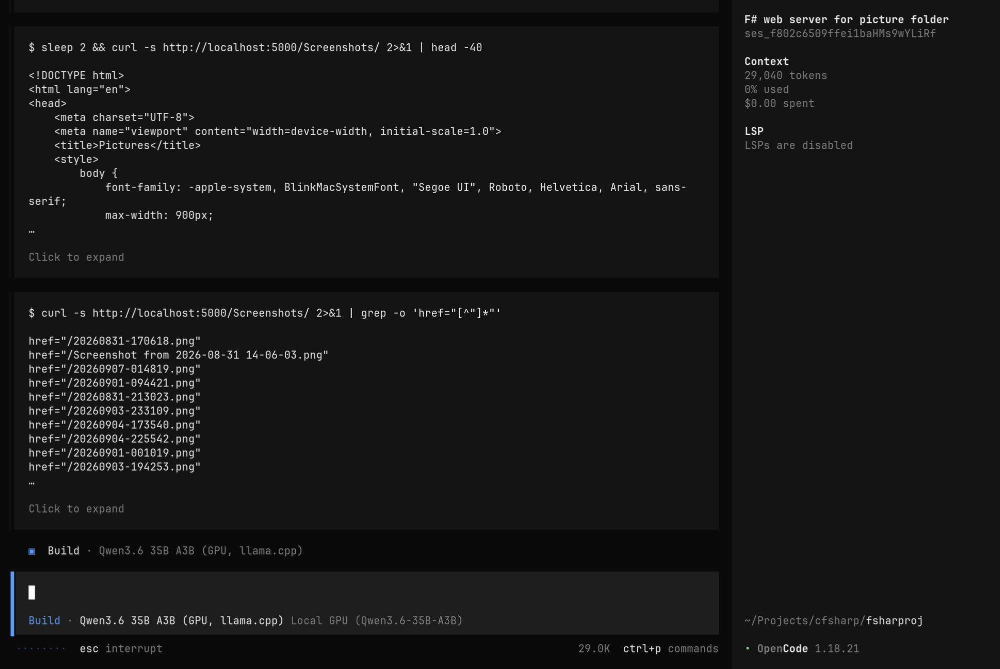

# lunar-lake-local-llm

A detailed, real-numbers writeup of building a two-tier local LLM coding
assistant entirely on one Intel Core Ultra 200V ("Lunar Lake") laptop — no
cloud API, no discrete GPU — wired into Neovim (`codecompanion.nvim`) and
OpenCode as an OpenAI-compatible backend. It's harder than "just run
`ollama run`" because this hardware has two genuinely different
accelerators (an NPU and an iGPU) with incompatible constraints, ~30GB of
RAM shared across all of it with zero disk swap, and a laptop-class MoE
serving stack that turned out to have more failure modes than the marketing
implies. This repo is for developers who want to replicate that setup, or
who just want the debugging trail for one specific accelerator/driver/model
stack that mostly isn't written down anywhere else yet.

Every config here is de-identified from the machine it was built on and
built to be read alongside the actual `configs/` files, not instead of them
— this README is the map, not the territory.

## Results, in three numbers

- **GPU tier steady-state: ~35-39 tok/s** generation on `Qwen3.6-35B-A3B`
  (Q4_K_M, `llama-cpp-vulkan`, `-ngl 99`) with speculative decoding
  (`--spec-type draft-mtp`) enabled — up from a ~26.6-27 tok/s baseline
  without it, a **+30-45%** throughput gain from the model's own built-in
  multi-token-prediction head, no separate draft model needed.
- **The GPU-serving stack itself was a coin flip that came up tails once**:
  OpenVINO's native GPU-plugin MoE path (`OFFLOAD_RATIO` expert streaming)
  never converged under thinking mode — **0/10** prompts completed — and
  crashed the driver outright on 4/10; the same model, same hardware, same
  quantization via `llama.cpp`'s Vulkan backend got **9/10** correct with no
  crashes. That single result is why this whole project runs on
  `llama-cpp-vulkan`, not OpenVINO, for the GPU tier.
- **NPU model bake-off: 9/10 vs. 4/10.** `Qwen2.5-Coder-7B-Instruct` beat
  `DeepSeek-R1-Distill-Qwen-7B` decisively on a fixed 15-prompt debugging
  set, and MoE architectures don't run on the NPU **at all**, on any
  OpenVINO release checked (architectural, not a tuning gap) — which is why
  the "hard tasks" model had to go on the iGPU in the first place.

Full methodology, seeded-vs-unseeded pitfalls, and every other benchmark
table (ubatch sweep, KV-cache quantization, thinking-mode accuracy/speed
tradeoff) are in
[docs/07-benchmarks-and-methodology.md](docs/07-benchmarks-and-methodology.md)
— this section is deliberately just the verdicts.

## Hardware

Intel Core Ultra 200V ("Lunar Lake"), Arc Graphics 130V/140V iGPU (Xe2, no
dedicated VRAM — shares system RAM), integrated Intel AI Boost NPU, ~30GB
total system RAM (0B disk swap at baseline, zram added later as a safety
net, not relied on for routine operation), NixOS (unstable channel). Full
detail and the reasoning behind every hardware-driven decision:
[docs/01-hardware-and-architecture.md](docs/01-hardware-and-architecture.md).

## Architecture

```
                editor/client layer (nvim codecompanion.nvim, OpenCode CLI)
                        │  OpenAI-compatible /v1/chat/completions
           ┌────────────┴─────────────┐
           ▼                          ▼
 npu-server-coder.service   ◄─Conflicts─►   gpu-server-hard.service
 port 8900, on-demand                       port 8901, on-demand
 server.py (bespoke) on                     llama-server (llama.cpp/Vulkan)
 openvino_genai.LLMPipeline                 --spec-type draft-mtp, -ngl 99
 Qwen2.5-Coder-7B-Instruct                  Qwen3.6-35B-A3B (Q4_K_M GGUF,
 (dense, NPU-optimized OV IR)               MoE: 256 experts, 8+1 active)
           │                                          │
           ▼                                          ▼
   Intel AI Boost NPU                    Intel Arc Graphics 130V/140V
   static-shape graph, dense-only        Vulkan `anv`, dynamic MoE routing

        ~30GB system RAM shared by CPU + this iGPU's driver heap
```

> **Update (2026-09-08):** the GPU tier's flags above reflect the config as
> originally tuned. A later investigation found Intel's Vulkan Flash
> Attention implementation, not MoE expert-routing, was the real prefill
> bottleneck, and changed the production flags to `-fa off` (dropping
> `--spec-type draft-mtp` and KV-cache quantization, and reducing context
> from 32768 to 24576) for a measured ~39% reduction in real request
> wall-clock time. Full writeup:
> [docs/10-fine-tuning-update-2026-09-08.md](docs/10-fine-tuning-update-2026-09-08.md).

> **Update (2026-09-09):** the GPU tier's model itself changed — `Qwen3.6-35B-A3B`
> was replaced by `Cohere North-Mini-Code-1.0` (`cohere2moe`, 30B total/3B
> active) after a broad candidate search, landing on `-c 65536` (2.67x the
> prior 24576 ceiling, at negligible extra RAM cost), `--spec-type ngram-mod`
> prompt-lookup speculative decoding, and `-ctk f16 -ctv q8_0` KV
> quantization — beating the old model's ~18.7-19.1 tok/s baseline with
> ~22-28 tok/s depending on task. The investigation also root-caused a real
> CPU thermal-throttling confound that had been silently contaminating
> benchmark comparisons on this laptop. Full writeup:
> [docs/11-north-mini-migration-update-2026-09-09.md](docs/11-north-mini-migration-update-2026-09-09.md).

The two services declare `Unit.Conflicts` on each other at the systemd
level — starting one force-stops the other — because concurrent operation
was tested, not assumed unsafe: with both warm, free RAM bottomed out at
~268MB with zero swap available at the time. Mutual exclusivity was chosen
deliberately over "concurrent, but risky." A third, optional component —
`gpu-guard`, a small C++ reverse proxy that retries a degenerate-stall/
false-refusal failure pattern — was built and verified but is **not wired
into this diagram**; see docs/09 below. Full walkthrough, including *why*
MoE architecturally cannot run on the NPU:
[docs/01-hardware-and-architecture.md](docs/01-hardware-and-architecture.md).

## Contents

| Doc | What's in it |
|---|---|
| [docs/01-hardware-and-architecture.md](docs/01-hardware-and-architecture.md) | The hardware, why two tiers instead of one model, why MoE architecturally cannot run on the NPU, the end-to-end diagram and `Conflicts=` reasoning |
| [docs/02-npu-tier-setup.md](docs/02-npu-tier-setup.md) | `hardware.cpu.intel.npu.enable`, the two custom Nix overlays that make OpenVINO's NPU plugin work on nixpkgs at all, the abandoned third overlay, the bespoke `server.py`, and the systemd unit |
| [docs/03-gpu-tier-setup.md](docs/03-gpu-tier-setup.md) | Model/runtime selection (why OpenVINO's GPU-MoE path and DeepSeek-Coder-V2-Lite were both rejected), Vulkan wiring with no system-wide NixOS graphics module, the chat-template crash and fix, a flag-by-flag read of the production `llama-server` invocation |
| [docs/04-thinking-mode-and-preservation.md](docs/04-thinking-mode-and-preservation.md) | The three easily-confused reasoning-control mechanisms (one is a confirmed no-op), the `enable_thinking` accuracy/speed benchmark and verdict, the `preserve_thinking` investigation |
| [docs/05-nvim-integration.md](docs/05-nvim-integration.md) | Wiring `codecompanion.nvim` to the GPU tier as an `openai_compatible` adapter, real bugs found along the way |
| [docs/06-opencode-integration.md](docs/06-opencode-integration.md) | Wiring OpenCode to both tiers as separate providers, the `small_model` mutual-exclusivity bug, the `options` raw-passthrough discovery verified via captured network traffic |
| [docs/07-benchmarks-and-methodology.md](docs/07-benchmarks-and-methodology.md) | The data backbone: NPU/GPU model bake-offs, the ubatch sweep, speculative decoding numbers, and a KV-cache-quantization benchmarking mistake told as a cautionary tale |
| [docs/08-troubleshooting-and-incidents.md](docs/08-troubleshooting-and-incidents.md) | Symptom → cause → fix lookup table, plus two full incident narratives (a systemd `Conflicts=` kill traced through a stray autocmd; two real OOM kills) |
| [docs/09-gpu-guard-optional.md](docs/09-gpu-guard-optional.md) | The parked (not deployed) C++ stall/false-refusal retry proxy — architecture, why built, why parked |
| [docs/10-fine-tuning-update-2026-09-08.md](docs/10-fine-tuning-update-2026-09-08.md) | A dated investigation update: root-causing a wall-clock regression, ruling out SYCL/vLLM/ggml-openvino/CPU-MoE-offload with fresh evidence, two self-caught citation corrections, the discovery that Flash Attention (not MoE routing) was the real Intel Vulkan prefill bottleneck, a rigorous interleaved benchmark, and an MXFP4 quantization result that didn't survive proper scrutiny |
| [docs/11-north-mini-migration-update-2026-09-09.md](docs/11-north-mini-migration-update-2026-09-09.md) | A full model-swap investigation: nine ruled-out MoE/dense candidates each with a real disqualifying reason, a chat-template bug found by hand-parsing a GGUF's raw bytes, an Intel-Arc coopmat crash root-caused and fixed then a deeper architectural dead end found anyway, speculative-decoding's tokenizer-compatibility wall, a live CPU-thermal-throttling investigation that overturned an earlier "clear winner" conclusion, a principled (not benchmark-driven) pivot to `ngram-mod`, and the full production cutover to `Cohere North-Mini-Code-1.0` with 2.67x the context window |

## Real usage

Screenshots of this setup actually being used for real work, not staged demos.

**OpenCode's `Build` agent, running the GPU-tier model, writing an F# web
server from scratch** — iterating with real shell commands (starting the
server, `curl`-testing its own endpoints, `grep`-checking the HTML output)
across a session that had used ~29000 of its 32768-token context window by this
point:



More will be added here as they come in.

## Quick start

Just want the files? Everything referenced above lives under
[configs/](configs/), organized to mirror the docs (`configs/npu-tier/`,
`configs/gpu-tier/`, `configs/nvim/`, `configs/opencode/`, `configs/shared/`,
`configs/gpu-guard/`) — copy and adapt in place, replacing the
`YOUR_USERNAME`/`YOUR_HOSTNAME` placeholders (see
`configs/shared/placeholders.md`) with your own. Want the reasoning first?
Start at [docs/01-hardware-and-architecture.md](docs/01-hardware-and-architecture.md)
and follow the "what to read next" pointers at the end of each chapter.

## Status and scope

This is a documentation snapshot of one specific, personal setup, not a
maintained product. It reflects exactly the software stack pinned in
[configs/shared/versions.md](configs/shared/versions.md) (a specific
nixpkgs commit, `llama-cpp-vulkan`, OpenVINO, OpenCode, and
`codecompanion.nvim` version) as of that pin's date — driver behavior,
chat templates, and llama.cpp/OpenVINO internals move fast, and there is no
guarantee anything here still applies to a newer release or to different
Intel silicon (Meteor Lake, Arrow Lake, etc.), even where the underlying
reasoning is expected to transfer. `gpu-guard` is built and verified but
parked/optional — it is not part of the default running architecture. This
repo is not accepting the premise that any of this is universal: treat
every number as "measured on this machine, on this date," and re-verify
before relying on it elsewhere.

## Motivation

I made this repo so you, user trying to deploy a local AI using intel
lunar lake architecture, dont have to spend a whole weekend debugging
with AI (like I did)... Hopefully, this will be of good use for you or
your AI reading this. 

## License

MIT — see [LICENSE](LICENSE).
